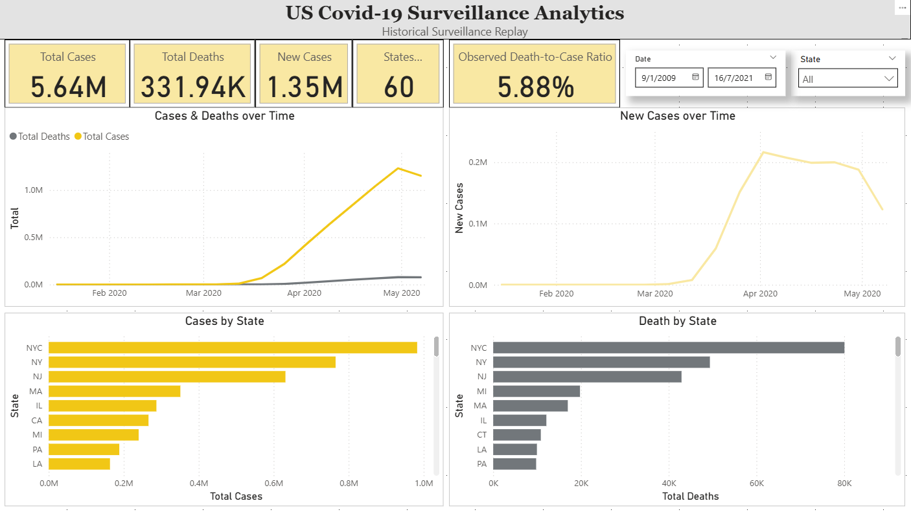
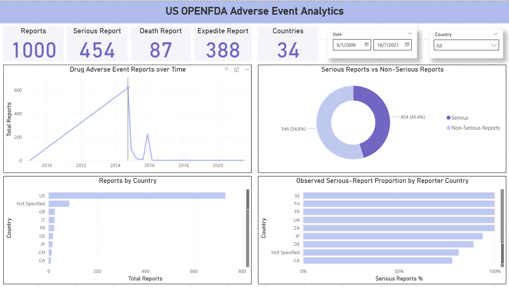
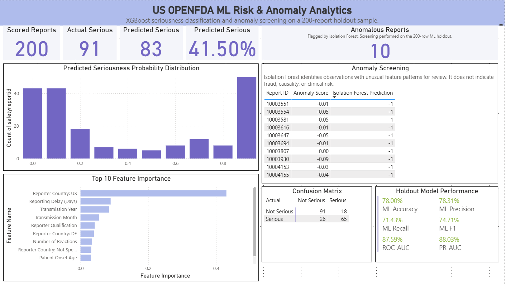
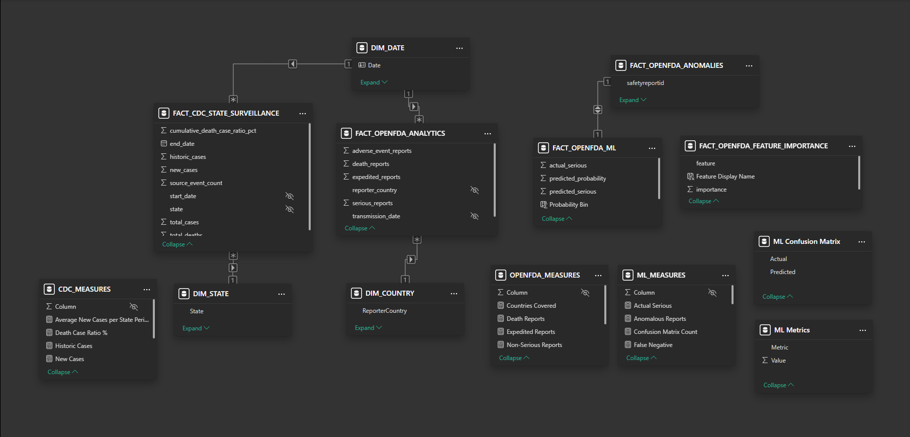
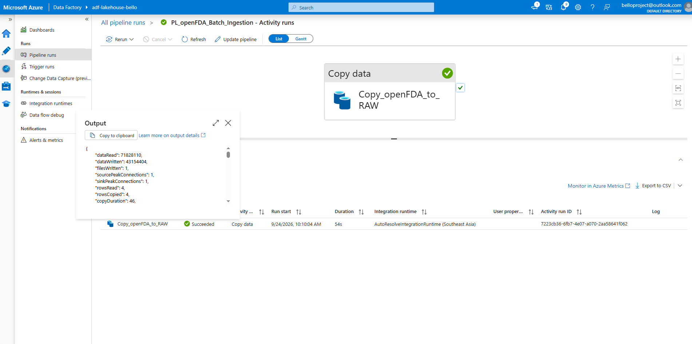
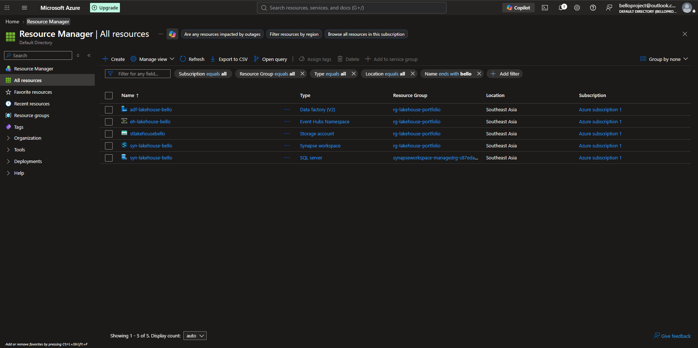

# Healthcare Public Health Surveillance & Risk Analytics Lakehouse

[](https://github.com/nabila-natasha/healthcare-public-health-lakehouse/actions/workflows/ci.yml)

An Azure-based healthcare and public-health analytics lakehouse portfolio project demonstrating batch ingestion, event-driven streaming, medallion architecture, data quality controls, analytical serving, machine learning, explainability, governance, CI/CD, and infrastructure-as-code foundations.

The project uses **public and synthetic data only**. It does not use real patient-identifiable information or PHI.

---

## 1. Project Overview

This project implements a cloud data platform for two complementary public-health and healthcare analytics workloads:

1. **CDC public-health surveillance**

   * Historical CDC surveillance data is replayed through Azure Event Hubs at an accelerated cadence.
   * The replay simulates near-real-time event arrival while preserving both event time and ingestion time.
   * Synthetic data-quality faults are injected to demonstrate duplicate detection and quarantine handling.

2. **openFDA adverse-event analytics**

   * FDA adverse-event data is ingested through Azure Data Factory using the openFDA REST API.
   * Paginated API responses are validated and landed in ADLS Gen2.
   * The data is transformed through Bronze, Silver, and Gold layers.
   * Machine-learning features, predictions, feature importance, and anomaly results are produced for analytical use.

The project is designed as a **portfolio-scale engineering implementation**, not as a production healthcare system or clinical monitoring platform.

---

## 2. Business and Engineering Objectives

### Business objectives

* Provide analytical views of public-health surveillance trends.
* Analyse openFDA adverse-event reporting patterns.
* Surface potentially unusual observations for analytical review.
* Provide business-facing dashboards through Power BI.
* Demonstrate how analytical and ML outputs can be served through a cloud lakehouse architecture.

### Engineering objectives

* Implement both batch and streaming ingestion patterns.
* Use ADLS Gen2 as the common analytical storage boundary.
* Apply a Bronze → Silver → Gold medallion architecture.
* Separate malformed streaming events into a quarantine path.
* Implement reproducible Python-based transformations.
* Serve analytical datasets through Synapse Serverless SQL.
* Build ML features and models using XGBoost and Isolation Forest.
* Apply SHAP-based explainability.
* Track ML experiments using MLflow.
* Implement automated code validation with GitHub Actions.
* Establish a Terraform foundation for future infrastructure management.
* Document security, governance, architecture decisions, and platform limitations.

---

## 3. Architecture

The platform combines batch ingestion, streaming ingestion, analytical transformations, ML experimentation, SQL serving, and Power BI.

```text
                         ┌─────────────────────────────┐
                         │ CDC Archived Public-Health  │
                         │ Surveillance Dataset        │
                         └──────────────┬──────────────┘
                                        │
                              Accelerated Replay
                                        │
                                        ▼
                              ┌─────────────────┐
                              │ Azure Event Hubs │
                              │ Kafka Protocol   │
                              └────────┬────────┘
                                       │
                                       ▼
                              ┌─────────────────┐
                              │ Python Consumer │
                              │ + Validation    │
                              └───────┬─────────┘
                                      │
                         ┌────────────┴────────────┐
                         │                         │
                       Valid                    Invalid
                         │                         │
                         ▼                         ▼
                    ADLS Bronze              ADLS Quarantine
                         │
                         ▼
                    ADLS Silver
                         │
                         ▼
                     ADLS Gold
                         │
                         └──────────────┐
                                        │
                                        ▼
                               Synapse Serverless
                                        │
                                        ▼
                                     Power BI


┌─────────────────────┐
│ openFDA REST API    │
│ Adverse Events      │
└──────────┬──────────┘
           │
           ▼
┌────────────────────────┐
│ Azure Data Factory     │
│ Paginated REST Copy    │
└──────────┬─────────────┘
           │
           ▼
       ADLS RAW
           │
           ▼
     ADLS BRONZE
           │
           ▼
     ADLS SILVER
           │
           ▼
      ADLS GOLD
           │
           ├──────────────────────┐
           │                      │
           ▼                      ▼
   Synapse Serverless       Databricks ML
           │                      │
           │                Managed UC Volume
           │                      │
           │                ML experimentation
           │                      │
           │                      ▼
           │              Controlled output handoff
           │                      │
           │                      ▼
           │                 ADLS ML Layer
           │                      │
           └──────────────┬───────┘
                          ▼
                       Power BI
```

### Architecture principles

* **ADLS Gen2** provides the common lake storage boundary.
* **Azure Event Hubs** provides the streaming ingestion endpoint.
* **Azure Data Factory** handles openFDA batch ingestion and orchestration.
* **Python** performs streaming validation and lakehouse transformations.
* **Parquet** is used for analytical Silver, Gold, and ML outputs.
* **Synapse Serverless SQL** provides the analytical serving layer.
* **Databricks Free Edition** provides a separate ML experimentation environment.
* The Databricks-to-ADLS handoff is intentionally documented as a controlled workaround because of Free Edition storage-integration limitations.
* **GitHub Actions** validates application and data-engineering code.
* **Terraform** provides an infrastructure-as-code foundation, but the current repository does not falsely claim full Azure resource management.

Detailed architecture decisions are documented in [`docs/architecture-decisions.md`](docs/architecture-decisions.md).

---

## 4. Data Model

The lakehouse separates the CDC public-health surveillance domain from the openFDA adverse-event domain while providing dedicated analytical serving views for each domain and the ML outputs.

### CDC surveillance model

The CDC Gold dataset supports state-level public-health surveillance analysis.

The analytical serving view is:

```text
dbo.vw_cdc_surveillance
```

The CDC flow is:

```text
CDC Events
    │
    ▼
Bronze
    │
    ▼
Silver
    │
    ▼
Gold
    │
    ▼
dbo.vw_cdc_surveillance
    │
    ▼
Power BI
```

### openFDA analytical model

The openFDA Silver layer separates the main adverse-event entities into:

* adverse-event reports
* reactions
* drugs

The transformation flow is:

```text
openFDA RAW
    │
    ▼
Bronze
    │
    ▼
Silver
 ┌──┴───────────────────────────┐
 │                              │
 ▼                              ▼
Adverse Events             Reactions / Drugs
 │                              │
 └──────────────┬───────────────┘
                ▼
             Gold
                │
                ▼
       Analytical Serving
```

### ML data model

ML features are generated from the openFDA Silver datasets.

```text
openFDA Silver
      │
      ▼
ML Feature Engineering
      │
      ▼
openfda_ml_features
      │
      ├───────────────┐
      │               │
      ▼               ▼
   XGBoost       Isolation Forest
      │               │
      ▼               ▼
 Predictions      Anomalies
      │               │
      └───────┬───────┘
              │
              ▼
        Feature Importance
              │
              ▼
          ADLS ML Layer
```

### Synapse serving model

The final analytical serving layer contains five Synapse Serverless views:

| View                                | Purpose                                     |
| ----------------------------------- | ------------------------------------------- |
| `dbo.vw_cdc_surveillance`           | CDC public-health surveillance analytics    |
| `dbo.vw_openfda_analytics`          | openFDA adverse-event analytical aggregates |
| `dbo.vw_openfda_ml_predictions`     | ML seriousness predictions                  |
| `dbo.vw_openfda_feature_importance` | XGBoost feature-importance results          |
| `dbo.vw_openfda_anomalies`          | Isolation Forest anomaly results            |

These views provide the Power BI consumption layer without exposing raw ingestion structures directly to dashboard users.

---

## 5. Visual Evidence

The repository contains selected screenshots demonstrating the implemented architecture, data engineering workflows, analytical serving, and ML outputs.

Screenshots are intentionally limited to useful portfolio evidence rather than every setup or troubleshooting screen.

### Power BI — CDC Surveillance

Dashboard:

**`US Covid -19 Surveillance Analysis`**



### Power BI — openFDA Analytics

Dashboard:

**`US OPENFDA Adverse Event Analysis`**



### Power BI — ML Risk & Anomaly Analytics

Dashboard:

**`US OPENFDA ML Risk & Anomaly Analytics`**



The ML dashboard includes model metrics, predictions, feature importance, and anomaly screening.

### Data Model



### Azure Data Factory

The ADF pipeline orchestrates paginated openFDA batch ingestion into ADLS Gen2.



### Azure Architecture / Resources




---

## 6. Technology Stack

| Area                   | Technology                   |
| ---------------------- | ---------------------------- |
| Cloud                  | Microsoft Azure              |
| Object storage         | Azure Data Lake Storage Gen2 |
| Batch orchestration    | Azure Data Factory           |
| Streaming ingestion    | Azure Event Hubs             |
| Streaming protocol     | Kafka protocol               |
| SQL serving            | Azure Synapse Serverless SQL |
| ML experimentation     | Databricks Free Edition      |
| Data processing        | Python / Pandas / PyArrow    |
| Analytical format      | Apache Parquet               |
| ML classification      | XGBoost                      |
| Anomaly detection      | Isolation Forest             |
| Explainability         | SHAP                         |
| Experiment tracking    | MLflow                       |
| BI                     | Power BI Desktop             |
| CI/CD                  | GitHub Actions               |
| Infrastructure as Code | Terraform foundation         |
| Testing                | pytest                       |
| Version control        | Git / GitHub                 |

---

## 7. Data Sources

### CDC

**Dataset:** Weekly United States COVID-19 Cases and Deaths by State - ARCHIVED

* Dataset ID: `pwn4-m3yp`
* Source type: public historical surveillance data
* Access pattern: REST API
* Ingestion pattern: streaming replay
* Azure component: Azure Event Hubs
* Destination: ADLS Gen2 Bronze
* Status: archived/discontinued source

The source is historical rather than a current live CDC feed. The project replays historical records at an accelerated cadence to simulate near-real-time event arrival.

### openFDA

* Domain: healthcare / pharmaceutical safety
* Dataset: FDA adverse-event data
* Access pattern: REST API
* Ingestion pattern: batch
* Azure component: Azure Data Factory
* Destination: ADLS Gen2 RAW

The openFDA ingestion pipeline uses API pagination and validates the resulting report identifiers before downstream transformation.

---

## 8. Lakehouse Data Layers

The project uses a medallion-style architecture.

```text
RAW
 │
 ▼
BRONZE
 │
 ▼
SILVER
 │
 ▼
GOLD
 │
 ▼
ML / SERVING
```

### RAW

Raw source data is retained close to the source representation.

Examples:

```text
healthcare/raw/openfda/openfda_adverse_events.json
healthcare/raw/cdc/...
```

### BRONZE

Bronze contains ingested and validated source records.

Examples:

```text
healthcare/bronze/openfda/openfda_adverse_events.csv
healthcare/bronze/cdc/...
```

### QUARANTINE

Quarantine is **not treated as a medallion layer**.

It is an exception path used to retain malformed streaming events that fail validation.

```text
                  Validation
                      │
              ┌───────┴────────┐
              │                │
            Valid            Invalid
              │                │
              ▼                ▼
           BRONZE          QUARANTINE
```

This prevents malformed records from silently entering downstream analytical datasets.

### SILVER

Silver contains cleaned, typed, structured Parquet datasets.

openFDA examples:

```text
adverse_events.parquet
adverse_event_reactions.parquet
adverse_event_drugs.parquet
```

### GOLD

Gold contains analytics-ready datasets designed around business and analytical grains.

Examples:

```text
openfda_gold.parquet
CDC Gold surveillance dataset
```

### ML

The ML layer contains model-ready features and model outputs.

```text
healthcare/ml/openfda/
├── openfda_ml_features.parquet
├── openfda_ml_predictions.parquet
├── openfda_feature_importance.parquet
└── openfda_anomalies.parquet
```

---

## 9. Streaming Data Engineering

The CDC streaming workflow uses Azure Event Hubs with Kafka protocol support.

```text
Historical CDC Dataset
        │
        ▼
Synthetic / Accelerated Replay
        │
        ▼
Azure Event Hubs
        │
        ▼
Python Consumer
        │
        ▼
Schema + Event Validation
        │
        ├───────────────┐
        │               │
        ▼               ▼
      Bronze        Quarantine
        │
        ▼
      Silver
        │
        ▼
       Gold
```

The event envelope contains:

```text
event_id
event_time
ingestion_time
source
source_dataset_id
payload
```

### Event identity

`event_id` is deterministically generated using SHA-256 from:

```text
state | start_date | end_date
```

This allows repeated deliveries of the same business event to be identified consistently.

### Data-quality faults

The replay intentionally demonstrates:

* duplicate delivery
* delayed event arrival
* malformed event missing a required field

The final validation demonstrated:

* 1,002 raw events
* 1,000 valid Bronze events
* 1 quarantined malformed event

Late events are logged and handled according to the validation logic rather than being presented as a real-time clinical feed.

---

## 10. Batch Data Engineering

The openFDA pipeline uses Azure Data Factory to retrieve paginated REST API responses.

```text
openFDA REST API
      │
      ▼
Azure Data Factory
      │
      ▼
Paginated API Requests
      │
      ▼
ADLS RAW
      │
      ▼
Bronze
```

The implemented validation demonstrated:

* 4 API pages
* 4,000 total reports
* 4,000 unique `safetyreportid` values
* 0 duplicate report IDs
* 1 combined RAW JSON output file

The ADF Copy activity reports `rowsRead = 4`, representing the four REST response pages rather than four individual reports.

The current ADF pipeline uses a fixed sink filename. A future production evolution would use run/date-based partitioning or unique output paths to avoid overwrite behavior between scheduled runs.

---

## 11. Transformation Pipeline

Python-based transformations convert source data through the lakehouse layers.

### CDC

```text
Bronze JSON
    │
    ▼
Python / Pandas
    │
    ▼
Silver Parquet
    │
    ▼
Python / Pandas
    │
    ▼
Gold Parquet
```

### openFDA

```text
Bronze CSV
    │
    ▼
Python / Pandas
    │
    ▼
Silver Parquet
    │
    ▼
Python / Pandas
    │
    ▼
Gold Parquet
```

Parquet is used because it provides:

* typed columns
* columnar storage
* compression
* efficient analytical reads
* explicit schemas
* interoperability across Python, Synapse, and Power BI serving workflows

---

## 12. Data Quality

Data-quality controls are implemented at multiple stages.

### CDC

* Required event-field validation
* Deterministic event identity
* Duplicate-delivery detection
* Event-time and ingestion-time preservation
* Malformed-event quarantine
* Bronze deduplication

### openFDA

* API pagination validation
* Report-count validation
* `safetyreportid` uniqueness validation
* Structured Silver schemas
* Null and type checks
* Controlled feature engineering inputs

The project includes automated tests using pytest.

Final repository validation:

```text
26 passed
```

Python compilation validation also completed successfully.

---

## 13. Machine Learning

The openFDA ML workflow uses the cleaned Silver datasets to generate analytical features and model outputs.

### Feature engineering

Features include:

* patient age
* patient sex
* reporter country
* reporter qualification
* number of reactions
* number of drugs
* transmission year
* transmission month
* reporting delay
* drug/reaction ratio

The target is a normalized serious-report indicator.

### Leakage controls

Potential leakage fields are explicitly excluded from the ML feature set, including:

```text
seriousnessdeath
fulfillexpeditecriteria
patientdeathdate
companynumb
```

The source `serious` field is used to derive the target and is not included as an input feature.

`safetyreportid` is retained for traceability but excluded from the model feature matrix.

### XGBoost classification

The XGBoost model was evaluated on a 200-row holdout set.

| Metric    | Result |
| --------- | -----: |
| Accuracy  | 0.7800 |
| Precision | 0.7831 |
| Recall    | 0.7143 |
| F1        | 0.7471 |
| ROC-AUC   | 0.8759 |
| PR-AUC    | 0.8803 |

Confusion matrix:

```text
True Negative  = 91
False Positive = 18
False Negative = 26
True Positive   = 65
```

The majority-class baseline accuracy was approximately 0.545.

These results are recorded as results from this project dataset and holdout split. They should not be interpreted as production clinical performance or as evidence of clinical effectiveness.

### Feature importance

The XGBoost model produced feature-importance results for analytical interpretation.

The strongest observed feature was a US reporter-country indicator. This is treated as a **model/sample signal**, not as a causal finding. Differences may reflect reporting practices, dataset composition, regulatory processes, or other characteristics of the sample.

### Anomaly detection

Isolation Forest was applied to the 200-row holdout dataset.

Configuration:

```text
n_estimators = 200
contamination = 0.05
random_state = 42
n_jobs = -1
```

Result:

```text
Rows evaluated = 200
Anomalies detected = 10
```

The anomaly output identifies observations with unusual feature patterns for analytical review. It does not indicate fraud, causality, or clinical risk.

### Explainability

SHAP is used to support model explainability and diagnostics.

The ML workflow therefore demonstrates:

```text
Feature Engineering
        │
        ▼
     XGBoost
        │
        ├──────────────┐
        ▼              ▼
 Predictions      SHAP Analysis
        │
        ▼
 Feature Importance

Feature Engineering
        │
        ▼
 Isolation Forest
        │
        ▼
 Anomaly Screening
```

---

## 14. Databricks Integration Boundary

Databricks Free Edition is used as a dedicated ML experimentation environment.

The ML notebook is:

```text
notebooks/Day6_OpenFDA_ML.ipynb
```

The managed Unity Catalog volume used for experimentation is:

```text
/Volumes/workspace/default/openfda_ml/
```

The workflow produces:

```text
openfda_ml_predictions.parquet
openfda_feature_importance.parquet
openfda_anomalies.parquet
```

### Important platform constraint

Databricks Free Edition serverless does not provide the arbitrary storage configuration required by this project for direct ADLS access.

Therefore, the current implementation uses a **controlled manual handoff** from the Databricks ML environment into the canonical ADLS ML layer.

This is intentionally documented as a platform-constrained portfolio workaround rather than being presented as fully automated Databricks-to-ADLS orchestration.

A more production-oriented implementation would use an appropriate Databricks environment with supported external locations, managed identities, or equivalent cloud storage integration.

See [`docs/databricks-integration.md`](docs/databricks-integration.md) and [`docs/adr/ADR-005-databricks-free-edition-integration.md`](docs/adr/ADR-005-databricks-free-edition-integration.md).

---

## 15. SQL Serving

Azure Synapse Serverless SQL provides the analytical serving layer.

The five serving views are:

```text
dbo.vw_cdc_surveillance
dbo.vw_openfda_analytics
dbo.vw_openfda_ml_predictions
dbo.vw_openfda_feature_importance
dbo.vw_openfda_anomalies
```

The views provide a stable analytical interface between the lakehouse storage layer and Power BI.

---

## 16. Power BI

Power BI Desktop provides the business-facing analytical layer.

The project contains three dashboards:

### 1. US Covid -19 Surveillance Analysis

Focuses on CDC public-health surveillance trends and state-level analytical patterns.

### 2. US OPENFDA Adverse Event Analysis

Focuses on adverse-event reporting patterns, seriousness, deaths, reporting trends, and geographic/reporting dimensions.

### 3. US OPENFDA ML Risk & Anomaly Analytics

Focuses on:

* ML model metrics
* seriousness predictions
* feature importance
* anomaly screening
* analytical interpretation of model outputs

The ML dashboard does not present model outputs as clinical decisions or causal findings.

The anomaly dashboard language is intentionally framed as:

> Isolation Forest identifies observations with unusual feature patterns for review. It does not indicate fraud, causality, or clinical risk.

---

## 17. Security and Governance

Security and governance controls include:

* least-privilege access
* Azure RBAC
* managed identities where supported
* Synapse managed identity access to project ADLS
* secured ADF API-key parameter handling
* Event Hubs secret handling through environment variables
* GitHub secret protection
* no credentials committed to source control
* explicit ML leakage controls
* CDC quarantine handling
* separation of RAW, BRONZE, SILVER, GOLD, and ML data
* read-only analytical serving patterns for Power BI

The project intentionally avoids claiming enterprise controls that are not implemented.

Examples of future production controls include:

* Azure Key Vault
* private endpoints
* VNet integration
* customer-managed keys
* Microsoft Purview
* centralized SIEM/security monitoring
* enterprise identity and access governance

See [`docs/security-governance.md`](docs/security-governance.md).

---

## 18. CI and Controlled Release Validation

GitHub Actions is used to automatically validate repository changes.

The CI workflow includes:

* Python tests
* Python compilation checks
* repository validation
* data-engineering transformation tests
* documentation consistency checks

The project also includes a manually triggered **controlled release-validation workflow**. It validates an intentionally selected branch, tag, or commit before release.

The release-validation workflow:

* checks out the selected release reference
* installs the project dependencies
* validates repository whitespace
* compiles Python source
* runs the full pytest suite
* generates a release summary

The release-validation workflow does **not** recreate, destroy, or deploy Azure infrastructure. The Azure portfolio environment was provisioned incrementally and is documented separately.

Terraform validation is performed independently from the application/data-engineering CI workflow.

---

## 19. Infrastructure as Code

A Terraform foundation is included under:

```text
infra/terraform/
├── main.tf
├── outputs.tf
├── README.md
├── variables.tf
├── versions.tf
└── .terraform.lock.hcl
```

Terraform validation completed successfully:

```text
terraform fmt -check
terraform validate
```

The current Terraform configuration establishes provider, variable, and output foundations but does **not** contain full Azure resource blocks for the existing environment.

Therefore, the project does not claim that the complete Azure platform is currently managed by Terraform.

The foundation is intended to support future migration toward declarative infrastructure management.

---

## 20. Architecture Decisions

Key architecture decisions are documented in:

[`docs/architecture-decisions.md`](docs/architecture-decisions.md)

The documented principles include:

1. ADLS Gen2 as the common lake storage boundary.
2. Batch and streaming patterns selected according to source characteristics.
3. Historical CDC replay used for reproducible streaming demonstrations.
4. Azure Data Factory used for openFDA batch ingestion.
5. Azure Event Hubs used as the streaming ingestion endpoint.
6. Python used for validation and transformations.
7. Parquet used as the analytical storage format.
8. Synapse Serverless used for SQL serving.
9. Databricks Free Edition used as a separate ML environment.
10. Controlled Databricks-to-ADLS handoff documented as a platform workaround.
11. Terraform introduced as an infrastructure foundation.
12. GitHub Actions used to validate application and data-engineering code separately from infrastructure provisioning.
13. Public and synthetic data used to avoid PHI.

Architecture Decision Records are stored under:

```text
docs/adr/
```

---

## 21. Repository Structure

```text
healthcare-public-health-lakehouse/
│
├── data/
│   └── fixtures/
│
├── docs/
│   ├── adr/
│   ├── screenshots/
│   ├── architecture.md
│   ├── architecture-decisions.md
│   ├── data-contract.md
│   ├── data-sources.md
│   ├── databricks-integration.md
│   ├── day4-cdc-streaming.md
│   ├── day7-power-bi-serving.md
│   ├── project-completion.md
│   └── security-governance.md
│
├── infra/
│   └── terraform/
│
├── ingestion/
│
├── notebooks/
│   └── Day6_OpenFDA_ML.ipynb
│
├── scripts/
│
├── sql/
│
├── transformations/
│   ├── silver/
│   ├── gold/
│   └── ml/
│
├── tests/
│
├── .github/
│   └── workflows/
│
├── .gitignore
└── README.md
```

Large runtime datasets and ML Parquet outputs are intentionally not committed to GitHub.

---

## 22. Current Azure Environment

| Component            | Resource                 |
| -------------------- | ------------------------ |
| Resource Group       | `rg-lakehouse-portfolio` |
| Region               | Southeast Asia           |
| Storage              | `stlakehousebello`       |
| Event Hubs Namespace | `eh-lakehouse-bello`     |
| Event Hub            | `healthcare-events`      |
| Event Hub Partitions | 4                        |
| Event Hub Retention  | 7 days                   |
| Data Factory         | `adf-lakehouse-bello`    |
| Synapse Workspace    | `syn-lakehouse-bello`    |
| Synapse Database     | `healthcare_analytics`   |
| ADLS Filesystem      | `healthcare`             |

The Synapse workspace default storage account is separate from the project ADLS storage account. The project ADLS account is connected through the configured external data source and managed identity access.

---

## 23. Engineering Outcomes

The completed project demonstrates:

### Data engineering

* Batch REST API ingestion
* Paginated API handling
* Event-driven streaming ingestion
* Kafka protocol usage with Event Hubs
* ADLS Gen2 lakehouse storage
* Medallion architecture
* Parquet-based analytical datasets
* Python/Pandas transformations
* Data-quality validation
* Duplicate detection
* Quarantine handling

### Analytics

* Synapse Serverless SQL
* Five analytical serving views
* Power BI dashboards
* Public-health surveillance analysis
* openFDA adverse-event analytics

### Machine learning

* Feature engineering
* Leakage prevention
* XGBoost classification
* Isolation Forest anomaly detection
* SHAP explainability
* MLflow experiment tracking
* ML output serving

### Engineering practices

* GitHub Actions CI/CD
* pytest validation
* Terraform foundation
* Architecture Decision Records
* Security and governance documentation
* Explicit platform constraints and technical limitations

---

## 24. Important Limitations

This project intentionally does **not** claim:

* a live CDC production feed
* production healthcare deployment
* PHI processing
* clinical monitoring
* clinical decision support
* clinical risk prediction
* causal relationships from openFDA reports
* production-grade ML performance
* fully automated Databricks Free Edition to ADLS integration
* full Terraform management of the Azure environment
* enterprise security controls that were not implemented

The CDC workflow uses historical data replayed at an accelerated cadence to demonstrate streaming engineering patterns.

The openFDA dataset represents adverse-event reports and should not be interpreted as a representative clinical population or as evidence of incidence or causality.

ML results are based on the project dataset and evaluation split and are presented for portfolio demonstration and analytical experimentation.

---

## 25. Future Production Evolution

If this architecture were evolved beyond the portfolio environment, potential next steps would include:

### Data ingestion

* Replace historical CDC replay with an appropriate live or operational source.
* Introduce durable ingestion checkpoints.
* Improve event replay and late-event handling.
* Partition ADF output by ingestion date or pipeline run.

### Storage and governance

* Introduce Azure Key Vault.
* Add private endpoints and network isolation.
* Introduce Microsoft Purview.
* Implement centralized security monitoring.
* Add enterprise data-retention and lifecycle policies.

### Databricks

* Move to a Databricks environment supporting the required ADLS external-location architecture.
* Replace the manual ML output handoff with automated orchestration.
* Integrate model workflows into a production ML lifecycle.

### Infrastructure

* Expand Terraform from a foundation into managed Azure resource definitions.
* Introduce environment-specific variables and state management.
* Add infrastructure validation to CI/CD.

### ML

* Increase training and validation dataset size.
* Use stronger temporal or grouped validation where appropriate.
* Monitor data drift and model drift.
* Establish model versioning and deployment controls.
* Validate model performance against representative production-like data before considering operational use.

---

## 26. Project Documentation

Detailed documentation is available in:

* [`docs/architecture.md`](docs/architecture.md)
* [`docs/architecture-decisions.md`](docs/architecture-decisions.md)
* [`docs/data-contract.md`](docs/data-contract.md)
* [`docs/data-sources.md`](docs/data-sources.md)
* [`docs/databricks-integration.md`](docs/databricks-integration.md)
* [`docs/day4-cdc-streaming.md`](docs/day4-cdc-streaming.md)
* [`docs/day7-power-bi-serving.md`](docs/day7-power-bi-serving.md)
* [`docs/project-completion.md`](docs/project-completion.md)
* [`docs/security-governance.md`](docs/security-governance.md)
* [`docs/adr/`](docs/adr/)

---

## 27. Final Summary

This project demonstrates an end-to-end Azure data engineering and analytics workflow spanning:

```text
Public / Synthetic Data
        │
        ├───────────────┐
        ▼               ▼
   Batch Ingestion   Streaming Ingestion
        │               │
        ▼               ▼
      ADLS RAW       Event Hubs
        │               │
        ▼               ▼
      BRONZE ────── Validation
        │               │
        │          ┌────┴─────┐
        │          ▼          ▼
        │       BRONZE    QUARANTINE
        │          │
        └──────────┤
                   ▼
                 SILVER
                   │
                   ▼
                  GOLD
                   │
          ┌────────┴────────┐
          ▼                 ▼
      Synapse           Databricks
      Serverless          ML
          │                 │
          │          Controlled Handoff
          │                 │
          │                 ▼
          │              ADLS ML
          │                 │
          └────────┬────────┘
                   ▼
                Power BI
```

The resulting portfolio demonstrates practical experience across **Azure Data Factory, Event Hubs/Kafka, ADLS Gen2, Synapse Serverless, Python, Pandas, Parquet, Power BI, XGBoost, Isolation Forest, SHAP, MLflow, GitHub Actions, pytest, and Terraform**, while explicitly documenting the boundaries and limitations of the free-tier and portfolio environment.
